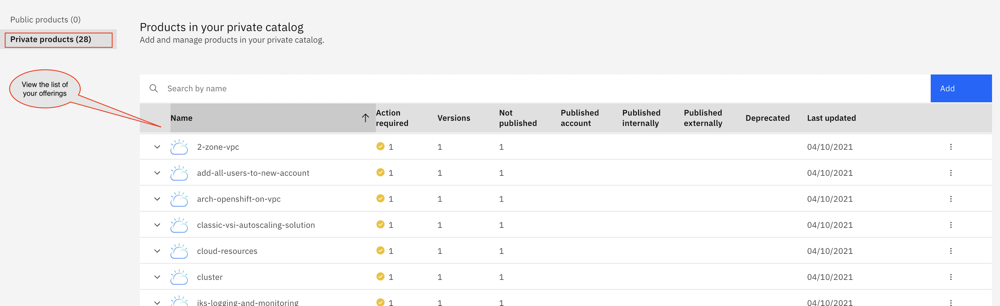

# About `onboard-to-ibm-catalog`

The `onboard-to-ibm-catalog` playbook is designed to bulk onboard a set of Terraform templates, from the Git organization, namely - [Cloud-Schematics](https://github.com/Cloud-Schematics), to a [private catalog](https://cloud.ibm.com/docs/account?topic=account-account-services#catalog-management-account-management) in your IBM Cloud account.  The [Cloud-Schematics](https://github.com/Cloud-Schematics) is a place where you will find many sample Terraform templates, for IBM Cloud.  The IBM Cloud team and the ecosystem will strive keep this org up-to-date, and add newer Terraform templates, for your reference.  

Once the Terraform templates are on your private catalog (as tiles on the catalog), you can easily explore the capabilities in the template and do your experimemnts using them.  The private catalog will also enable you to share these templates, with other users in your Account. 

You can also run the `onboard-to-ibm-catalog` playbook using the [IBM Cloud Schematics action](https://cloud.ibm.com/docs/schematics?topic=schematics-about-schematics#how-to-actions) feature. 

You can refer to the Ansible playbook and the related Python code, to custom develop your own automation that can selectively onboard Terraform templates to a private catalog.  

## Prerequisites

Before you begin, make sure that you are assigned the following permissions
- To create a [private catalog](https://cloud.ibm.com/docs/account?topic=account-account-services#catalog-management-account-management) in IBM Cloud.
- To create an [IBM Cloud Schematics action](https://cloud.ibm.com/docs/schematics?topic=schematics-access).

## Run the playbook in Schematics UI

1. Open the [Schematics action configuration page](https://cloud.ibm.com/schematics/actions/create?name=ansible-is-instance-actions&url=https://github.com/Cloud-Schematics/onboard-to-ibm-catalog).
2. Review the name for your action, and the resource group and region where you want to create the action. Then, click **Create**.
3. Select the `main.yml` playbook that you want to run.
4. Select the **Verbosity** level to control the depth of information that will be shown when you run the playbook in Schematics.
5. Required: Expand the **Advanced options** to enter all the required input variables in key-value pairs as shown in the table.

    | Key | Value|
    | --- | --- |
    | GIT_BASE_URL | `Enter the base URL. For example, https://github.com/Cloud-Schematics` |
    | GITHUB_TOKEN | `Enter your Git repository private access token details` |
    | CATALOG_NAME | `Enter the catalog name. For example, bulkonboard_cloudschematicsrep` |
    | CATALOG_MANAGEMENT_APIKEY | `Enter your IBM Cloud API key` |
    
6. Click **Save**.   
7. Click **Check action** to verify your action details. The **Jobs** page opens automatically. You can view the results of this check by looking at the logs.
8. Click **Run action** to perform the onboarding on all the Terraform templates into IBM Cloud private catalog. You can monitor the progress of this action by reviewing the logs on the **Jobs** page.

**Note:** As and when, newer versions of the Terraform templates are published in the [Cloud-Schematics](https://github.com/Cloud-Schematics), you can run **Run action** again to onboard the new templates & the newer version of the Terraform templates.

## Verification steps

1. Open the [IBM Cloud catalog management](https://cloud.ibm.com/content-mgmt/catalogs).
2. Click your catalog name link to view the list of product offerings in the private catalog.

    **Example of the screen capture**
    
3. You can further click the required offerings, accept the license, and click **Install** to create the workspace. **Note** Ensure you provide all the required input variables as per the readme file of the offering in the **Settings** page to provision the resources through Schematics workspace.

## Reference

Review the following links to find more information about IBM Cloud Schematics action and IBM Cloud catalog management:

- [IBM Cloud Schematics action documentation](https://cloud.ibm.com/docs/schematics)
- [IBM Cloud catalog management](https://cloud.ibm.com/docs/account?topic=account-accountfaqs)

## Getting help

For help and support with using this template in IBM Cloud Schematics, see [Getting help and support](https://cloud.ibm.com/docs/schematics?topic=schematics-schematics-help).

